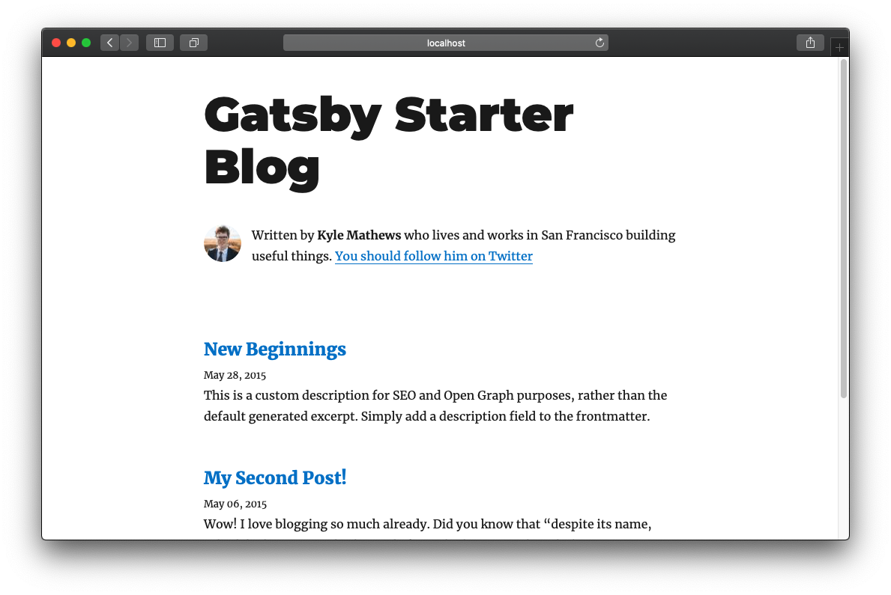

ふとブログを作ってみたいと思ったので以前から気になっていたNetlify + Gatsbyでブログを構築してみることにしました。

##とりあえず環境構築
install Gatsby  
`yarn global add Gatsby`

Gatsbyのテンプレートを引っ張ってくる  
`gatsby new folderName https://github.com/gatsbyjs/gatsby-starter-blog`

実行  
`gatsby develop`  
[http://localhost:8000](http://localhost:8000/)を開く

  
これだけで一通りブログを構築できました。

##gatsby-config.jsの中身を弄る
ヘッダーのタイトルやプロフィールの説明文を変更するにはgatsby-config.jsの中身を変更する必要があります。  
デフォルトではこんな感じになっています。  
```javascript
module.exports = {
  siteMetadata: {
    title: `Gatsby Starter Blog`,
    author: {
      name: `Kyle Mathews`,
      summary: `who lives and works in San Francisco building useful things.`,
    },
    description: `A starter blog demonstrating what Gatsby can do.`,
    siteUrl: `https://gatsby-starter-blog-demo.netlify.com/`,
    social: {
      twitter: `kylemathews`,
    },
  },
  plugins: [
    ...
  ],
}
```
これを今回はこのような形に変更しました。
```javascript
module.exports = {
  siteMetadata: {
    title: `Pori's blog`,
    author: {
      name: `Pori`,
      summary: `TypeScript React`,
    },
    description: `趣味でプログラム書いてる変な人です。`,
    siteUrl: `https://pori.wtf`,
    social: {
      twitter: `PoriWTF`,
    },
  },
  plugins: [
    ...
  ],
}
```
その他の設定項目は[http://localhost:8000/___graphql](http://localhost:8000/___graphql)で色々見れるみたいです。
