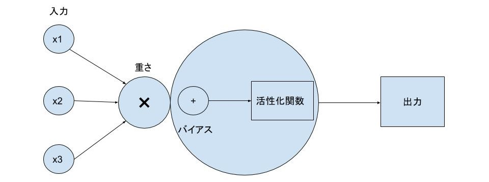

# 結論
ニューラルネットワークとはニューロンを層状に並べたもの  
ディープラーニングはニューラルネットワークを更に層状に並べたもの

## 人工ニューロン

- ニューロンの入力に重みをかけて足し合わせ、バイアスを加える
- 重さとは結合強度で信号の伝わりやすさを表す
- これらの計算を活性化関数で実行し、一つの値を返す

## 人工ニューラルネットワーク
- ニューロンを層状に並べたもの
- 数値を入力して情報を伝播させる
- 出力は確率などの予測値として解釈できネットワークによって予測ができる
- ニューロンや層を増やすことで制度が上げられる

## 人工ニューラルネットワークの学習方法
- 出力と正解の誤差が小さくなるよう重みとバイアスを調整していく
- 一層ずつ遡るように誤差を伝播させて重みとバイアスを更新する
- このアルゴリズムはバックプロパゲーションと呼ばれる

## ディープラーニング
- ニューラルネットワークを何層にも並べたもの
- 何層からディープラーニングと呼ぶかの定義はない
- 何層にも重ねれば重ねるほど精度は上がるが学習は難しくなる