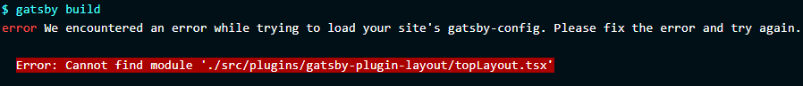

## このブログの開発をしていた時の話。
ローカルで動作確認をしてgitにpushしたところいつまで立っても本番サイトの更新がされなかったのでnetlifyのコンソールを見てみた。  
すると開発環境では何も問題がなかったのにtopLayout.tsxが見つからないというエラーが。  

ローカルでは問題なく動いていたのでそんなはずないとGitHubのコミットログをたどってみると[fix filename to camelCase](https://github.com/PolyWTF/pori.wtf/commit/5ec3ebdcdb768efae5af00047802460f1e4f265d)というcommitからエラーが出始めていた。  
内容としてはファイルの名前をcamelCaseに変更したのでGatsbyの設定のパスを変更するものだったがよくよく見てみると  
local: topLayout.tsx  
Github: TopLayout.tsx  
と変更したファイルの名前がgitに反映されておらずローカルではパスが通っているため動作するがNetlifyのビルドではファイルの名前が異なっているのでエラーが発生していた。  

## 解決方法
git mv TopLayout.tsx topLayout.tsx  
gitはファイルの名前の大文字、小文字を区別しないようなのでcaseを変更するときはgit mvコマンドを使わないと行けないらしい。  